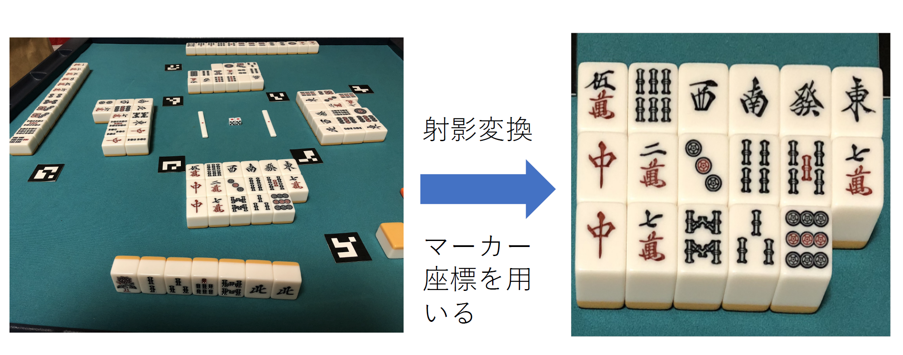
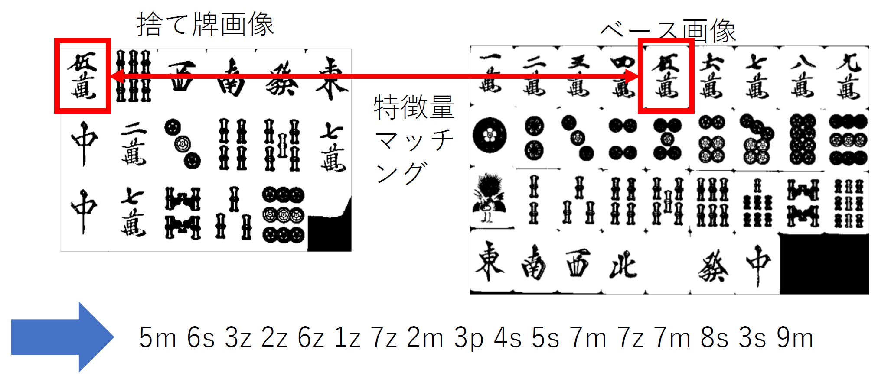
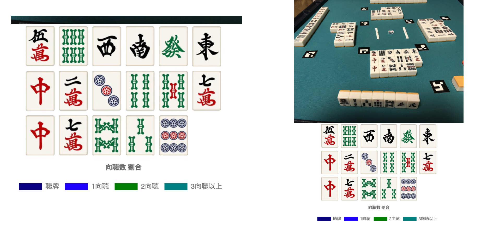

# huyohai-recognition
### Djangoを用いたWebアプリケーションの形で実装しました
1. OpenCVのマーカーを麻雀卓に配置し、写真を撮影することで、牌の自動認識を行います。
2. 認識された牌は不要牌類似計量法式を用いて解析を行い、推定結果をユーザに返します。

### マーカーを用いた射影変換

### A-KAZEを用いた類似度軽量

### デモ画像

